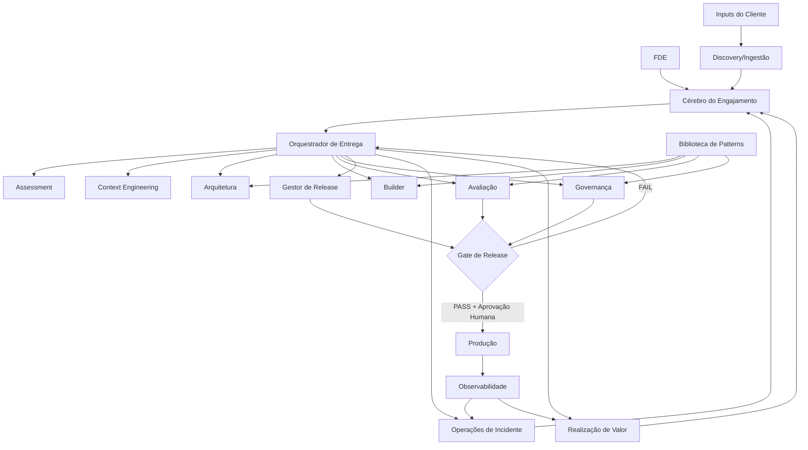

# Arquitetura do Sistema

## Camadas

- **Experiência:** CLI, integração com IDE, console web opcional.
- **Orquestração:** roteamento de workflow ciente de estado e seleção de próxima melhor ação.
- **Agentes:** agentes especialistas com fronteiras de responsabilidade explícitas.
- **Conhecimento:** estado estruturado, ADRs, riscos, requisitos e artefatos.
- **Avaliação e Governança:** golden sets, regressões, segurança, latência, custo e gates de aprovação humana.
- **Execução:** scaffolding de código, testes, infraestrutura e adaptadores de deploy.
- **Observabilidade:** traces, logs, métricas de token/custo, incidentes e métricas de negócio.

## Plano Compartilhado vs. Plano do Cliente

O **Plano de Metodologia Compartilhado** contém agentes reutilizáveis, schemas, patterns, templates, checklists e evals genéricos. O **Plano de Engajamento do Cliente** contém dados, código, arquitetura, decisões e incidentes específicos daquele cliente.

## Restrição

Agentes não são donos da verdade. Estado estruturado persistido e artefatos versionados são a fonte de verdade.
