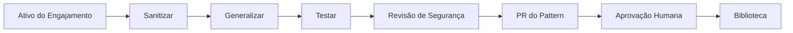

# Biblioteca de Padrões

## Objetivo

Criar entrega composta: cada engajamento melhora a entrega futura sem vazar informação específica de cliente.

## Estrutura de um Pattern

```text
patterns/enterprise-rag/
├── pattern.yaml
├── README.md
├── architecture/
├── src-template/
├── infra/
├── evals/
├── guardrails/
├── observability/
├── cost-model/
└── runbook/
```

## Catálogo Inicial

enterprise-rag, document-processing, human-approval, tool-calling-api, sql-analytics-agent, service-management-agent, customer-service-agent, multi-agent-review, async-long-running-workflow, private-network-ai, pii-redaction, model-router, agent-memory, incident-diagnosis.

## Maturidade

Experimental → Validado → Testado com cliente → Comprovado em produção → Preferido

## Fluxo de Promoção


