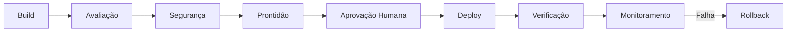

# Plano de Controle de Produção

## Domínios de Prontidão

Arquitetura, Confiabilidade, Segurança, Qualidade de IA, Observabilidade, Operações, FinOps, Aceite de Negócio.

## Modelo de Gate

```text
QUALIDADE              PASS / FAIL
SEGURANÇA              PASS / FAIL
OPERABILIDADE          PASS / FAIL
FINOPS                 PASS / FAIL
DONO DE NEGÓCIO        APROVADO / REJEITADO
DONO TÉCNICO           APROVADO / REJEITADO
```

Qualquer FAIL crítico bloqueia a produção.

## Ciclo de Vida


