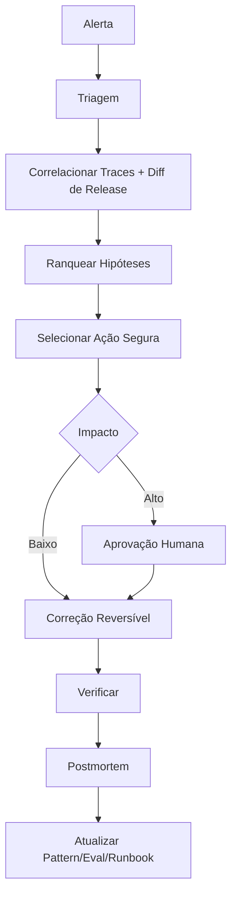

# Operações de Incidente

## Categorias

Regressão de modelo, indisponibilidade de provedor, falha de ferramenta/API, problema de retrieval, evento de segurança, anomalia de custo, degradação de performance, ação de negócio incorreta.

## Fluxo

Agentes podem coletar evidência, ranquear causas e preparar comandos de rollback. O rollback em produção permanece controlado por política.
