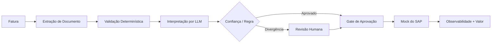

# Demo — Automação de Faturas de Fornecedor

12.000 faturas/mês; tempo de atendimento na baseline de 14 minutos.

Avaliação: acurácia de campo ≥95%, zero lançamento no SAP sem aprovação, p95 <5s excluindo HITL, custo/documento abaixo do limiar, testes de prompt injection aprovados.
