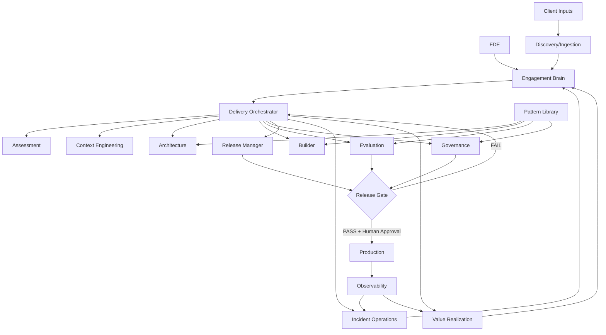

# System Architecture

## Layers

- **Experience:** CLI, IDE integration, optional web console.
- **Orchestration:** state-aware workflow routing and next-best-action selection.
- **Agents:** specialist agents with explicit responsibility boundaries.
- **Knowledge:** structured state, ADRs, risks, requirements and artifacts.
- **Evaluation and Governance:** golden sets, regressions, security, latency, cost and human approval gates.
- **Execution:** code scaffolding, tests, infrastructure and deployment adapters.
- **Observability:** traces, logs, token and cost metrics, incidents and business metrics.

## Shared Plane vs. Client Plane

The **Shared Methodology Plane** holds reusable agents, schemas, patterns, templates, checklists and generic evals. The **Client Engagement Plane** holds the data, code, architecture, decisions and incidents specific to that client.

## Constraint

Agents do not own the truth. Persisted structured state and versioned artifacts are the source of truth.
