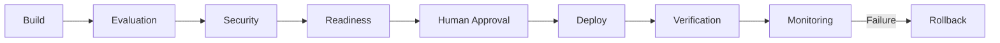

# Production Control Plane

## Readiness Domains

Architecture, Reliability, Security, AI Quality, Observability, Operations, FinOps, Business Acceptance.

## Gate Model

```text
QUALITY                PASS / FAIL
SECURITY               PASS / FAIL
OPERABILITY            PASS / FAIL
FINOPS                 PASS / FAIL
BUSINESS OWNER         APPROVED / REJECTED
TECHNICAL OWNER        APPROVED / REJECTED
```

Any critical FAIL blocks production.

## Lifecycle


