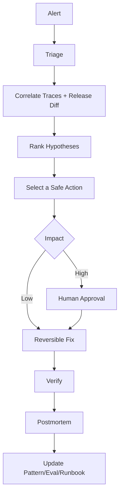

# Incident Operations

## Categories

Model regression, provider outage, tool or API failure, retrieval problem, security event, cost anomaly, performance degradation, incorrect business action.

## Flow

Agents can gather evidence, rank causes and prepare rollback commands. Rollback in production remains policy-controlled.
