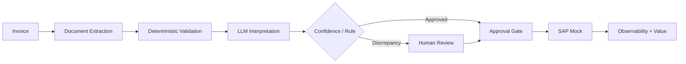

# Demo — Supplier Invoice Automation

12,000 invoices per month; baseline handling time of 14 minutes.

Evaluation: field accuracy ≥95%, zero SAP postings without approval, p95 under 5s excluding HITL, cost per document below the threshold, prompt-injection tests passed.
