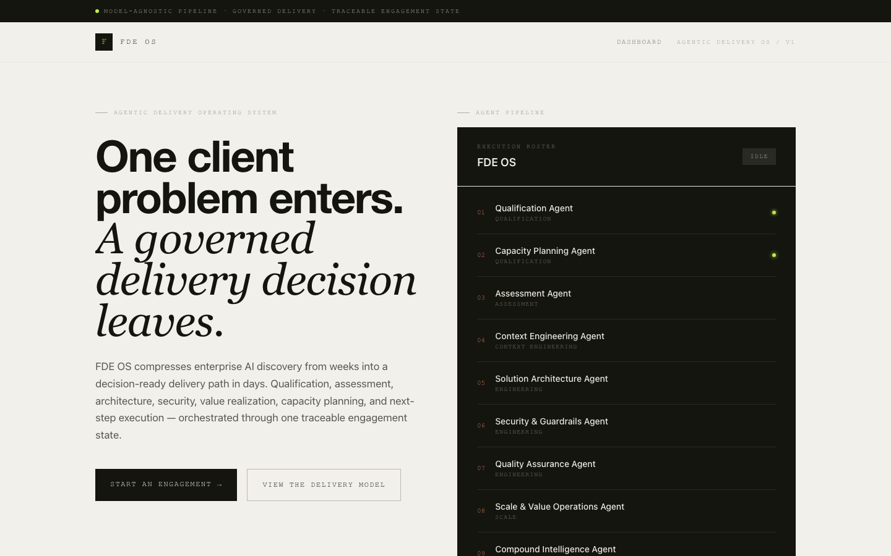

# FDE OS — Platform



A solo Forward Deployed Engineer sells and delivers applied Gen AI engagements
alone: qualifying the opportunity, sizing the effort, running discovery,
designing the architecture, writing the guardrails, running QA, and reporting
value back to the sponsor. Every one of those steps produces a document a
client will actually read. Doing that by hand, engagement after engagement,
means the quality of the deliverable tracks how much attention that
particular week allowed — and none of the reasoning behind a fit score, an
architecture decision, or a guardrails verdict survives past the chat session
it was typed in.

This platform turns that sequence into a pipeline instead of a habit. You
give it one engagement brief — or the client's raw discovery document, and it
extracts the brief for you. Nine specialist agents run against it in order,
each reading every report the agents before it produced, and hand back one
consolidated Enterprise Report — the kind of document a business sponsor and
a technical reviewer can both sit down with. The last agent in the pipeline,
Compound Intelligence, exists so the engagement doesn't end at "automation
shipped": it extracts the client's own proprietary know-how surfaced during
delivery, states how governance and cost visibility apply across the stack,
and names what should be promoted into the shared pattern library versus what
must stay inside this client's boundary — the mechanism by which delivery
compounds instead of resetting to zero on the next engagement.

## What happens when you use it

1. You paste the client's discovery document, or upload it as `.txt`, `.md`,
   `.pdf`, or `.docx`, and hit "Extract brief" — the fields below it (customer,
   industry, objective, baseline, constraints) fill themselves in. You review
   and correct them before continuing; the agents treat the full document as
   the primary source of truth and the fields as a condensed excerpt of it.
2. You hit "Run agent pipeline." The Qualification and Capacity Planning
   agents score the opportunity and size the effort first — before anything
   else runs, so a bad fit or an unrealistic timeline gets flagged early
   instead of buried in page twelve.
3. Assessment, Context Engineering, Architecture, Guardrails, and QA run in
   sequence. Each one reads the brief plus every prior agent's output, so the
   Architecture agent already knows what the Assessment agent found, and the
   Guardrails agent is reviewing an actual proposed system, not a hypothetical
   one. The dashboard shows each agent's status with a verb suited to what
   it's actually doing — Qualifying, Estimating, Assessing, Ingesting,
   Architecting, Hardening, Validating, Operating, Compounding — not a generic
   "running" spinner.
4. Scale & Value and Compound Intelligence close the pipeline: the first
   projects realized ROI and an operations runbook, the second extracts the
   client's own proprietary know-how surfaced along the way and states what
   should feed back into a shared, reusable pattern library.
5. A Master Orchestrator step reads all nine reports and writes an executive
   summary that cites specific figures from them — the fit score, the
   estimated effort, the ROI projection, the architecture decision, the
   guardrails verdict — instead of restating generic claims.
6. The executive summary and all nine phase reports are assembled into one
   Enterprise Report, styled and print-ready, with every Mermaid diagram
   rendered independently so one malformed diagram degrades to its raw
   source instead of blanking the page. Served at
   `/api/engagements/:id/report`.
7. "Export PDF" in the report's header hands the sponsor a PDF. It goes
   through the browser's own print pipeline rather than a headless renderer
   on the server — no extra dependency, and nothing that would need a
   different answer once this is running on serverless. The print stylesheet
   forces `print-color-adjust: exact`, without which browsers drop
   backgrounds and the dark executive-summary card prints cream-on-white,
   losing the one page a sponsor is guaranteed to read.

## How it's built

```
Browser (dashboard, new-engagement form)
        │
        ▼
Next.js API routes  ──▶  SQLite (Turso/libSQL, via Drizzle)
        │                     stores: engagements, phase_runs, reports
        ▼
Agent pipeline (src/lib/agents/run-pipeline.ts)
        │  sequential calls through lib/agents/llm-client.ts, one per agent
        │  in the roster, each call's context = brief + every prior agent's
        │  output
        ▼
Report renderer (src/lib/report/render.ts)
        │  Markdown → styled HTML, one self-contained document
        ▼
Consolidated Enterprise Report
```

It's a single Next.js app (App Router, TypeScript) — the frontend and the
API routes live in the same deployable unit, so there's no separate backend
service to stand up or keep in sync.

State lives in SQLite through Drizzle ORM, using the `@libsql/client` driver.
That's a deliberate choice, not the default: Vercel's serverless functions
have a read-only, ephemeral filesystem, so a plain local SQLite file would
vanish between requests. The libSQL driver speaks the exact same API against
a local `file:` database in development and a remote Turso database in
production, so the schema and every query in `src/lib/db/` work unmodified
in both places — only the connection string changes.

Every agent is a system prompt in `src/lib/agents/prompts/`, listed in
`src/lib/agents/roster.ts` alongside its phase. The roster mirrors the phase
structure already defined in
[`../specs/agent-roster.md`](../specs/agent-roster.md) — Qualification,
Assessment, Context Engineering, Engineering, Scale. Phases carry their
plain English names, with no acronym in front of them. The
report renderer converts each agent's Markdown output to HTML and wraps it in
the visual language carried over from the `content-machine` project:
Helvetica Neue for display type, italic Instrument Serif for accents,
JetBrains Mono for uppercase micro-labels, on a cream-paper/ink palette with
lime, amber, and rust accents.

Motion is used sparingly and never carries meaning on its own: the idle agent
roster pulses down its nine status dots so the pipeline reads as a sequence
rather than a list, the hero's second line cycles through the artifacts the
pipeline returns, and the empty intake box cycles hints for what belongs in a
discovery document. All three resolve to a static first state under
`prefers-reduced-motion` and never start a timer.

**Model routing.** `src/lib/agents/llm-client.ts` centralizes every LLM call
behind one `generateText()` function: Gemini 3.7 Flash first, falling back to
Claude Haiku 4.5 automatically if the Gemini call errors or `GEMINI_API_KEY`
isn't set. Nine sequential agent calls plus a synthesis call is enough volume
per engagement that a fast/cheap primary model matters; the fallback means a
missing or rate-limited Gemini key degrades the pipeline instead of breaking
it. Every phase run records which model actually answered, for the audit
trail. Each call carries a 90-second timeout — without one, a hung request
has no way to fail, and a stalled pipeline looks identical to a slow one.

**Reasoning tokens are billed against the output budget.** Gemini 3.x spends
part of `maxOutputTokens` thinking before it writes anything. Measured on a
real agent prompt: 1,315 reasoning tokens against 1,464 visible ones, so
roughly half the ceiling was gone before the artifact started. On the first
full engagement this clipped the Scale & Value agent at 7,996 completion
tokens against an 8,000 ceiling — its artifact ended mid-heading, was stored
as if complete, and rendered into the report with no error raised anywhere.
The agent budget is now 24k, and `generateText()` returns a `truncated` flag
(Gemini `finishReason: MAX_TOKENS`, Anthropic `stop_reason: max_tokens`) so
the pipeline warns instead of persisting a half-written artifact silently. A
budget too tight to fit any answer is also why an empty Gemini response is
worth naming explicitly rather than treating as a generic failure.

**Mermaid diagrams are a known sharp edge.** Early testing produced diagrams
that silently failed to render — unquoted node labels containing a literal
`\n`, and Gantt task names containing a colon (Mermaid's own delimiter
character). `src/lib/agents/report-style.ts` now gives every agent an
explicit, strict Mermaid syntax checklist (quote every label, use `<br/>` not
`\n`, never a bare colon in label or task text, keep diagrams under ~12
nodes), and the report renderer renders each diagram independently via
`mermaid.render()` in a try/catch — a syntax error in one diagram falls back
to a labeled code block showing its source instead of leaving the whole
report blank past that point. Every diagram is also capped to the same
max-width/max-height in CSS, so a 20-node architecture diagram and a 4-node
flowchart read at a consistent size instead of whatever mermaid happened to
lay out.

**LaTeX gets the same belt-and-braces treatment.** Agents reach for it when
writing thresholds and units, and nothing here renders maths, so the markup
arrives verbatim — one engagement produced 144 spans of it, including
"Processing $\ge 65\%$" in a table meant for a business sponsor. The house
style guide discourages it and `stripInlineLatex()` in
`src/lib/report/markdown.ts` translates what still slips through into plain
Unicode (≥, ≤, →, ±, Σ, ≠, linearized fractions).

The delicate half is the inverse mistake: a dollar sign usually means money,
and turning "$18,500" into "18,500" would quietly corrupt the commercials in
a client deliverable. Amounts are therefore lifted out *before* any delimiter
pairing — pairing first mis-associates the signs on a line that mixes both
("costs $18,500 at $\ge 85\%$ accuracy") and strands a delimiter in the
output. `scripts/test-latex-strip.ts` pins the behaviour with 21 cases
covering maths, money, both on one line, adjacent amounts, and the PERT and
reconciliation formulae the estimation and QA agents actually emit.

## One honest limitation

The whole pipeline runs synchronously inside a single API request (capped at
`maxDuration = 300` seconds in `src/app/api/engagements/[id]/run/route.ts`).
Nine sequential model calls plus the synthesis call comfortably fit inside
that today, but there's no mid-pipeline resume — if a call in a much larger
future roster timed out, you'd rerun the whole engagement. There's also no
auth or multi-tenant isolation yet — one shared database, which matches the
"solo FDE" scope this implements first, not the multi-FDE platform sketched
in [`../docs/system-architecture/15-roadmap.md`](../docs/system-architecture/15-roadmap.md).

## Stack

- **Next.js 15** (App Router, TypeScript) — frontend + API routes in one app.
- **SQLite via Turso/libSQL + Drizzle ORM** — see above.
- **Gemini 3.7 Flash primary, Claude Haiku 4.5 fallback** (`@google/generative-ai`,
  `@anthropic-ai/sdk`) — powers every agent in the roster.
- **`pdf-parse` + `mammoth`** — server-side text extraction for uploaded
  `.pdf` and `.docx` discovery documents.
- **Tailwind CSS** — the `content-machine`-derived visual language described
  above.
- **Framer Motion** — the three motion treatments above, and nothing else.
  shadcn is deliberately not installed: its components ship their own tokens
  (`bg-primary`, `text-muted-foreground`, `font-display`), which would put a
  second, conflicting palette next to the one this project already has.

## Local development

```bash
cp .env.example .env.local
# fill in GEMINI_API_KEY and/or ANTHROPIC_API_KEY; leave DATABASE_URL as
# file:./local.db for local dev
npm install
npx tsx src/lib/db/migrate.ts   # creates local.db with the schema
npm run dev
```

Open http://localhost:3000, create an engagement at `/dashboard/new`, then
run its pipeline from the engagement detail page. The consolidated report is
served at `/api/engagements/:id/report`.

Keep the checkout outside any cloud-synced folder (iCloud Drive's Desktop &
Documents, Dropbox, OneDrive). The sync daemon intercepts file access, and on
a tree with `node_modules` and `.git` in it that shows up as `next dev`
hanging with zero CPU, renames silently reverting, and stray "folder 2"
copies appearing — symptoms that look like disk corruption and are not.

### Working on an engagement that already ran

- `npx tsx scripts/regenerate-report.ts <engagementId>` re-synthesizes the
  executive summary and re-renders the HTML from the already-stored phase
  outputs — use it after editing the report template or a stored artifact,
  and skip re-running the full billed pipeline. `POST
  /api/engagements/:id/regenerate-report` does the same thing over HTTP.
- `npx tsx scripts/repair-truncated.ts <engagementId> <agentKey>` re-runs one
  agent and everything downstream of it, rebuilding the context chain exactly
  as the pipeline would. For when a single artifact is bad — truncated, say —
  and the agents after it consumed that bad text as context.
- `npx tsx scripts/test-latex-strip.ts` checks the report sanitiser. Worth
  running after touching `stripInlineLatex()`, since its failure mode is
  silent corruption of figures rather than an error.

## Deploying to Vercel

1. Create a [Turso](https://turso.tech) database and get its `libsql://` URL
   and auth token.
2. In the Vercel project settings, set the environment variables:
   - `GEMINI_API_KEY` and/or `ANTHROPIC_API_KEY`
   - `DATABASE_URL` (the `libsql://...` URL)
   - `DATABASE_AUTH_TOKEN`
3. Run the schema bootstrap once against the Turso database:
   `DATABASE_URL=... DATABASE_AUTH_TOKEN=... npx tsx src/lib/db/migrate.ts`
4. Deploy. `vercel.json` in this directory sets the framework preset and
   build/install commands; point the Vercel project's root directory at
   `platform/`.
